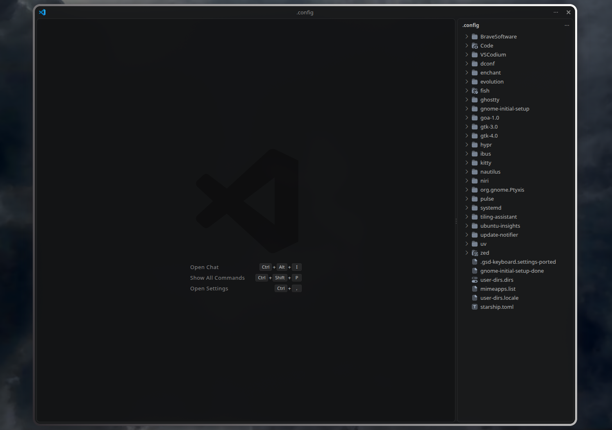
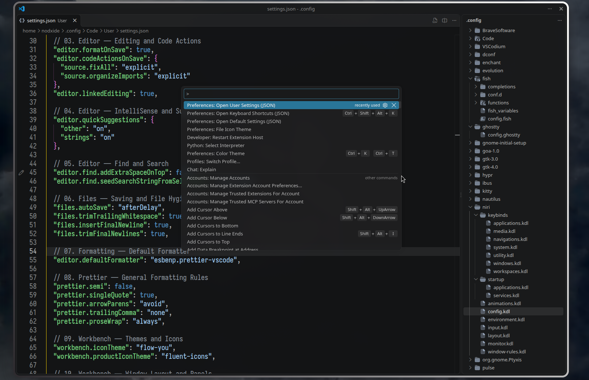

 
 

  <h1>Visual Studio Code Setup</h1>
  

    
    
  

---

## Overview

This repository contains a personalized Visual Studio Code configuration designed to reduce interface clutter and streamline everyday development workflows.

The setup focuses on a minimal interface, keyboard-driven navigation, consistent formatting, and efficient use of the editor, Explorer, integrated terminal, and development tools.

## What's Included

| File | Description |
| --- | --- |
| `settings.json` | Editor appearance, typography, tabs, Explorer, terminal, formatting, Git, workspace trust, and privacy settings. |
| `keybindings.json` | Custom shortcuts for navigation, refactoring, file management, terminal operations, debugging, and development tools. |

## Design Principles

- **Minimalist interface** — reduce visual clutter and prioritize the editor.
- **Keyboard-first workflow** — minimize reliance on the mouse for common operations.
- **Efficient navigation** — streamline tab switching, code navigation, and file management.
- **Consistent formatting** — use Prettier and editor code actions where configured.
- **Developer ergonomics** — use Iosevka in the editor and JetBrainsMono Nerd Font in the terminal.
- **Privacy-conscious configuration** — disable VS Code telemetry reporting.

## Requirements

- Visual Studio Code.
- Linux with a compatible integrated terminal shell. The configuration selects Fish as the default Linux shell.
- Recommended fonts:
  - Iosevka or Iosevka Term.
  - JetBrains Mono or JetBrainsMono Nerd Font.
- Relevant extensions and themes:
  - [Prettier — Code formatter](https://marketplace.visualstudio.com/items?itemName=esbenp.prettier-vscode)
  - Flow You file icon theme.
  - Fluent Icons product icon theme.
  - TODO Tree, if you use its keybinding.
  - Dart, if you use the Dart launch command.
  - Claude Code, if you use its extension-specific keybinding.

Install only the extensions you need. Shortcuts associated with extensions will not work if their commands are unavailable.

## License

This project is licensed under the MIT License. See [LICENSE](LICENSE).
